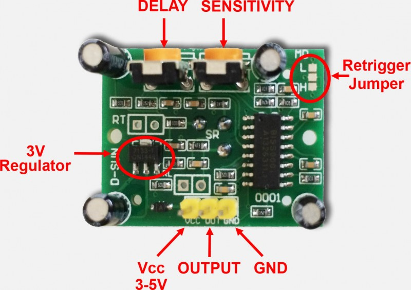

# micropython_playground
Hallo, mit dieser Anleitung lernst du MicroPython programmieren in einer halben Stunde. Klingt gut, oder? Los geht‘s. 

## REPL

Um Kommandos an den Microcontroller zu schicken und Ausgaben zu erhalten gibt es in Micropython die REPL (read eval print loop, also etwa Befehle annehmen, ausführen und Ergebnisse ausgeben Wiederholschleife). Diese ist entweder über USB oder WLAN (web-repl) erreichbar. Fürs erste ist WLAN einfacher und ausreichend. Allerdings muss man zunächst mit dem Accesspoint begnügen, da das wlan passwort noch nicht eingerichtet ist. 
* Auf https://github.com/micropython/webrepl –> Code –> Download ZIP 
* In einen Ordner entpacken.
* Mit dem Access Point des Microcontrollers verbinden:
* SSID: esp32_micropython
* PW: HappyBirthday
* Mit dem Browser webrepl.html öffnen. 
* Die Adresse auf ws://192.168.4.1:8266/ lassen und auf connect klicken. 
* Das Passwort ist „AllesGute“.
* Es sollte jetzt die folgende Zeile zu sehen sein: 
```
>>> 
```
Dort kann man jetzt Befehle eintippen. z.B. um das WLAN einzurichten und zu verbinden:
```
>>> set_wlan('Deine_SSID','DEIN_WLAN_PW')
>>> connect()
```
Beim nächsten Start sollte sich der Microcontroller automatisch mit dem WLAN verbinden. Es können auch mehrere WLANs eingegeben werden. 


Den folgenden Abschnitt kannst du erstmal überspringen. 

Um länger herumzuspielen ist es allerdings komfortabler, sich eine Entwicklunsumgebung (IDE) einzurichten. Dann kann man sich auch per USB mit der REPL verbinden. Ich empfehle VSCode mit dem pymakr plugin. Folgende Schritte sind dazu notwendig:
* Beides installieren:
    * https://code.visualstudio.com/download
    * https://marketplace.visualstudio.com/items?itemName=pycom.Pymakr
* Den MicroController per USB verbinden.
* Den Com-port ermitteln: Unten auf „All commands“, dann „pymakr > Extra > List Serial ports“
* Das sollte einen Eintrag mit Silicon labs finden.
* Unter „All commands“, dann „global Settings“ klicken, eine Konfigurationsdatei.
* Unter "address" den comport (zB „COM1“) angeben, 
* Unter "autoconnect_comport_manufacturers" „Silicon labs“ angeben (, nicht vergessen)


## Grundbefehle
### Variablen
In der REPL können nun Variablen zugeordnet werden, das können Zahlen oder Text sein:
```
>>> x=1
>>> name=“Peter“ 
# ist das Kommentarzeichen, alles dannach wird nicht als Befehl interpretiert
>>> x+5 # wenn der Befehl ein Rückgabewert ergibt wird dieser in der nächsten Zeile ausgegeben
6
Ein = ist eine Zuordnung von einem wert zu einer Variable, zwei == ein Vergleich:
>>> x==5 # das sollte doch 6 sein, oder?
False
```

### Container (fortgeschritten, kann auch erstmal übersprungen werden)
Mehrere Werte (egal ob Zahlen oder Text) können in Listen, Tupel, Sets oder Dicts zusammengefasst werden. Die Art der Klammer entscheidet:
```
>>> mylist=[1,2,10] # eine Liste namens mylist
>>> mytuple=(1,3,4) # die Namen können natürlich frei gewählt werden
>>> myset={1,42,5}
>>> mydict={10:20, 30:40}
```

Die Hauptunterschiede:
Listen können verändert und erweitert werden, Tuples nicht.
```
>>> mylist.append(20)
>>> mylist
[1, 2, 10, 20] 
```

Bei Listen und Tupeln kann man auf die Elemente mit der Nummer (startet bei 0) mit [] zugreifen, bei Sets geht das nicht:
```
>>> mytuple[0]
1
>>> mylist[1]=5
>>> mylist
[1, 5, 10, 20] 
```

Sets enthalten jedes Element nur einmal, und die Reihenfolge ist zufällig:
```
>>> myset.add(42) 
>>> myset
{42, 1, 5} 
```
Bei dicts greift man nicht mit der Nummer, sondern mit Schlüsseln auf die Elemente zu:
```
>>> mydict[10]
20
>>> mydict[name]=66
>>> mydict
{'Peter': 66, 10: 20, 30: 40}
```
### Bedingungen:
Wenn eine Bedingung erfüllt ist, soll etwas gemacht werden, sonst etwas anderes:
```
>>>if x==6:
		print('ja, x ist 6')
   else:
		print('nein, x ist nicht 6')
```

### Schleifen:
Sollen Befehle mehrfach ausgeführt werden so bieten sich Schleifen an. Bei einer While-Schleife wird der Befehl block solange ausgeführt, wie die Bedingung wahr ist.
```
>>>x=0
>>>while x < 5:
	x=x+1

>>>x
5

```
Bei for loops nimmt eine Variable (hier i) alle Werte aus einer Sequenz (zB Liste) an:
```
>>>for i in range(10):
	time.sleep(.5)
	led.on()
	time.sleep(.5)
	led.off()

```
Das Einrücken ist dabei wichtig. Es definiert, welche Befehle zu dem Block gehören, der wiederholt werden soll. 


### Funktionen
Komplexere Befehle können in Funktionen zusammengefasst werden. Dafür verwendet man def
```
>>>def blink(n=10,ontime=1, offtime=1):
		for i in range(n):
			led.off()
			time.sleep(offtime)
			led.on()
			time.sleep(ontime)
			led.off()
```

Funktionen werden mit Parametern in runden Klammern aufgerufen. Es gibt viele bereits definierte Funktionen. Werden weniger Parameter übergeben als in der Definiert wurden, so werden die voreingestellten Werte (hier 10 Wiederholungen, 1 Sekunde an, eine Sekunde aus)
```
>>>blink(6) #6 bezieht sich auf den ersten Parameter (n)
>>>print("Happy Birthday, Peter")# das ist eine eingebaute Funktion
>>>blink(ontime=.5, offtime=.2) # hier bleibt n auf der Voreinstellung (10 Wiederholungen)
```
Manche Funktionen geben einen Wert zurück, andere (wie unsere Blink-Funktion) nicht. Hier eine Funktion mit Rückgabe: Es wird die CPU temperatur ermittelt. Dazu wird der wert in Grad Celsius umgerechnet. 
```
>>>def temp():
	    tf = esp32.raw_temperature()
    	tc = (tf-32.0)/1.8
    	return tc
>>> temp()
65.55556
```

### Klassen
Komplexe Gruppen von Variablen und Funktionen Können in Klassen zusammengefasst werden, z.B. um Sensoren zu beschreiben, die eine Bestimmte Funktionalität bereitstellen, so wie die LED in dem Beispiel oben.

### Module
Mehrere Klassen, Funktionen und Variablen können in Modulen zusammengefasst werden, damit diese bei Bedarf importiert werden können:
```
>>>import time # Das „time modul“ wird importiert
>>>time.sleep(5) # warte 5 sekunden
>>>import math # puh, Mathe
>>>math.sqrt(math.pi) # die Wurzel von pi
1.772454
```
Es gibt viele MircoPython spezifische Module, um die Hardware zu steuern. Die LED oben wurde Beispielsweise so definiert:
```
>>>import machine
>>>led=machine.Pin(5, machine.Pin.OUT)
```
Dabei ist Pin eine Klasse, und PIN.OUT eine Variable innerhalb der Klasse.
Für mehr Details gibt es den Aufruf der Hilfefunktion:
```
>>>help(machine.Pin)
```
stellt alle Funktionen der Pin Klasse dar.

## Programmablauf
Bei jedem Start führt der uC zunächst die Datei „boot.py“, dann sofern vorhanden die Datei „main.py“ aus. Ich habe es so vorbereitet, dass in boot.py wird das wlan eingerichtet wird. Wenn die Datei um eine SSID und ein Passwort ergänzt wird dann muss nicht das Netzwerk gewechselt werden um webrepl nutzen zu können. 
Die main.py enthält typischerweise, d.h. wenn der uC ohne Eingabe über die REPL eine Aufgabe erfüllen soll eine Endlosschleife. Wenn nicht hört das Programm nach der main.py auf und wartet auf weitere Befehle über die REPL. 

## Beispiele:
Ich habe ein paar Module zum Ausprobieren zusammengestellt. Natürlich können alle zusammen verwendet werden, es sind der Phantasie keine Grenzen gesetzt. 
### Neopixel LEDs
Dies sind einzeln adressierbare RGB LEDs. Zunächst sollte +5V mit 5V, GND mit GND, und DIN mit einem GPIO pin, zB Pin Nr 4 verbunden werden. Die Neopixel werden dann folgendermaßen angesteuert:
```
import neopixel
np=neopixel.NeoPixel(machine.Pin(4),8) #initialisiere 8 LEDs an GPIO Pin 4
np[0]=10,10,10 # Die erste LED soll weiss (aber nicht so hell) sein
np[1]=255,0,0 # dann 100% rot
np[2]=0,255,0 # grün
np[3]=0,0,255 # blau
np.write() # die LEDs werden angesteuert
```

### Servo motor
Kleine Hobby Servo Motoren können auf einen Winkel zwischen 0 und etwa 180° eingestellt werden, über eine PWM Frequenz. Die Ansteuerung wird über das Servo Modul (servo.py) erleichtert. 
Für das Beispiel habe ich das gelbe Servo Kabel an Pin12 angeschlossen, Braun an GND und Rot an 5V.
```
from machine import Pin
from time import sleep
from servo import Servo
servo = Servo(Pin(12))
servo.setPosition(0)
sleep(1)
servo.setPosition(90)
sleep(1)
servo.setPosition(180)
sleep(1)
servo.deinit()
```
### Spannung messen
Die Li-ion Batterie (max 4.2V) ist über einen Spannungsteiler (2 mal 100k Widerstand) an GPIO Pin 35 angeschlossen. Um die Batteriespannung zu messen verwendet man analog to digital converter (ADC). Das ist hier demonstriert:

```
import machine
adc = machine.ADC(machine.Pin(35))
adc.atten(machine.ADC.ATTN_11DB) #In dem modus kann bis 3.5 V gemessen werden, bei ener Auflösung von 12 bit (2 hoch 12=4096 Werte)
adc.read()/1**12*3.5 # Pin Spannung. 
vbat=adc.read()/1**12*7 # Batterie Spannung ist doppelt so hoch.
print('Batterie spannung: {}V'.format(vbat))
```

### OLED Display
Das OLED Display wird über den seriellen i2c Bus angesteuert. Dieser braucht 2 Verbindungen: eine für den Takt (scl) und eine für die Daten (sda). Standard sind Pins 21 und 22 für i2c. Zusätzlich noch 3V und GND für die Stromversorgung. 
```
from machine import I2C, Pin
from display import Display
i2c=I2C(0,sda=Pin(21), scl=Pin(22), freq=100000)
oled=Display(i2c, width=128, height=32, upsidedown=False)
oled.fill(0) #alles aus
oled.smiley(x=20,y=16,r=15) #ein Lachgesicht
oled.text(['Happy', 'Birthday'],x1=40,y1=10) # Liste mit Wörtern: Jedes Wort in extra Zeile
oled.show() # Jetzt wird alles abgeschickt
```
### Beschleunigugns und Lagesensor
Auch dieser Sensor kommuniziert über i2c. Er kann parallel zu dem Display angeschlossen werden, oder an eigene Pins. Der Sensor liefert 3 Werte für lineare Beschleunigung (in Richtung x,y,z), 3 Werte für Rotationsbeschleunigung (um x y z Achsen), und die Temperatur. Als kleine übung müssen hier noch die Pins angelötet werden. 
```
from mpu6050 import MPU6050   
from machine import I2C, Pin
i2c=I2C(0,sda=Pin(21), scl=Pin(22), freq=100000)
sensor=MPU6050(i2c,buffer_size=3)   
sensor.get_values()
```
### Ultrasound Entfernungsmesser
Der Sensor funktioniert indem die Laufzeit des Schalls gemessen wird. Es wird ein Schallimpuls ausgesendet, dieser wird an einem Hindernis reflektiert und das Echo wird wieder detektiert. Die Zeitdifferenz ist proportional zur Entfernung zum Hindernis.
```
from ultrasonic import UltrasonicDistance
sensor=UltrasonicDistance(14,12)
sensor.distance()
```
### PIR sensor

Dies ist ein Bewegungsmelder, basierend auf Änderungen im Infrarotbereich. Es werden also Wärmeänderungen detektiert. 
Angeschlossen wird er an GND, ein beliebigen GPIO (zB 12) und 5V
Die Funktion ist so einfach, dass ich kein Modul erstellt habe: Wenn eine Bewegung detektiert wird, wird der Ausgangspin für eine bestimmte Zeit auf 1 gesetzt.
```
from machine import Pin
pir = Pin(12, Pin.IN)
print(pir.value())  
# gibt 1 aus, wenn kürzlich eine Bewegung registriert wurde, ansonsten 0
```
Der Sensor hat 2 Potis und 1 Jumper zur Konfiguration:
* Sensitivität-Potti: Gegen den Uhrzeigersinn unempfindlicher, im Uhrzeigersinn empfindlicher. 
* Verzögerung: Regelt die Dauer, die die Ausgabe nach einer Bewegung auf 1 bleibt: Gegen den Uhrzeigersinn kürzer, min ca 1 Sekunde, im Uhrzeigersinn länger. 
* Jumper L: Bewegungen werden nur detektiert, wenn Ausgabe 0 ist, d.h. bei kontinuierlicher Bewegung schaltet der Sensor zwischenzeitlich auf 0
* Jumper H: Bewegungen immer detektiert d.h. bei kontinuierlicher Bewegung bleibt der Sensor zwischenzeitlich auf 0

Natürlich könnte man jetzt eine Endlossschleife machen und jede Sekunde den Wert ausgeben (als Test ist das eine gute Idee), aber eine andere Möglichkeit sind Interrupts: Wenn sich der Zustand des Pins ändert wird ein Funktion aufgerufen. Die REPL läuft dazu parallel, d.h. man kann ganz normal Befehle eingeben, aber wenn eine neue Bewegung erkannt wird, wird die Interrupt Funktion ausgelöst, mit dem pin als parameter:
```
#definiere eine Funktion (hier wird einfach mit print ein Text ausgegeben)
def interrupt_function(pin):
	print('der Wert aendert sich zu {}'.format(pin.value()))
#definiere den Interrupt pin und weise die Funktion zu
interupt=pir.irq(handler=interrupt_function, trigger=Pin.IRQ_FALLING | Pin.IRQ_RISING)	

#der interupt kann zeitweise aktiviert und deaktiviert werden 
interupt=pir.irq(handler=None, trigger=0)
```

## Ich will mehr
Kannste haben! Hier gibt es jede Menge Infos:
* Micropython: https://docs.micropython.org/en/latest/
* Python Kurs (wie hier, nur ausführlicher und besser erklärt): http://python4kids.net/how2think/

